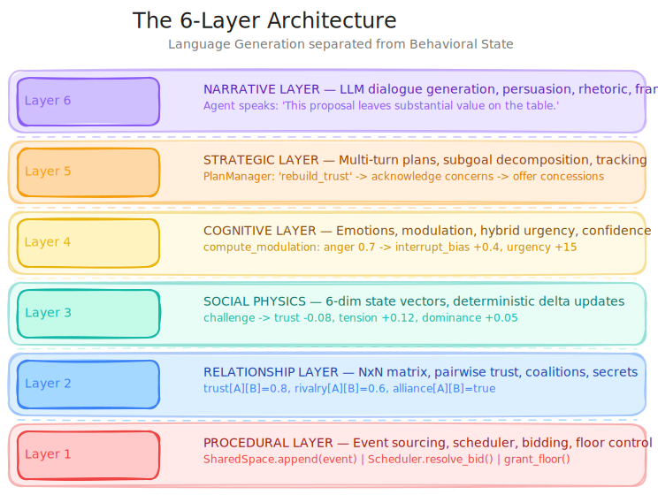
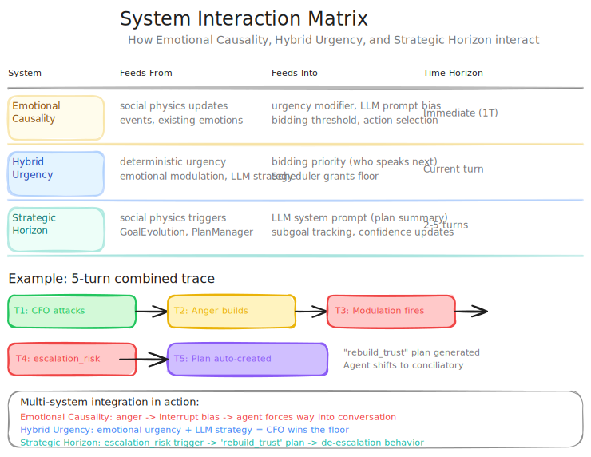
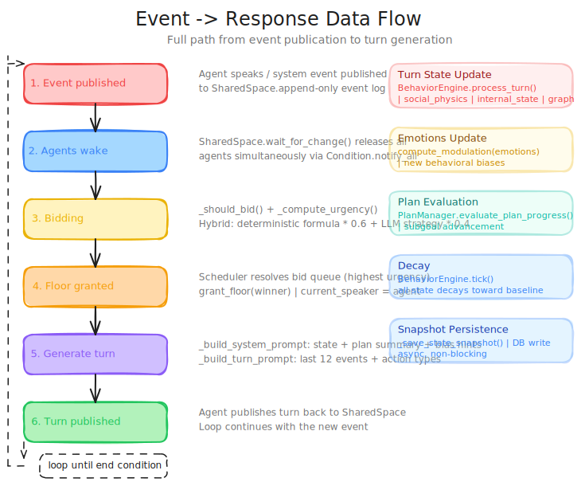
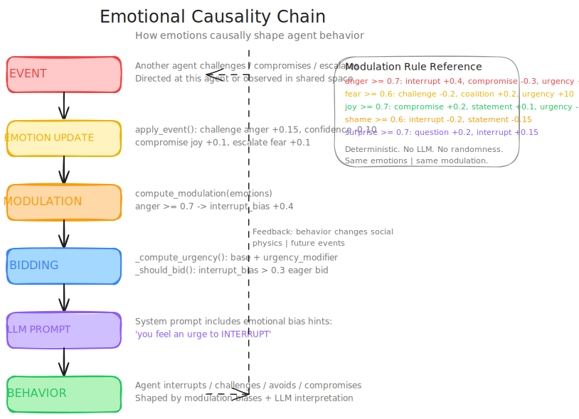
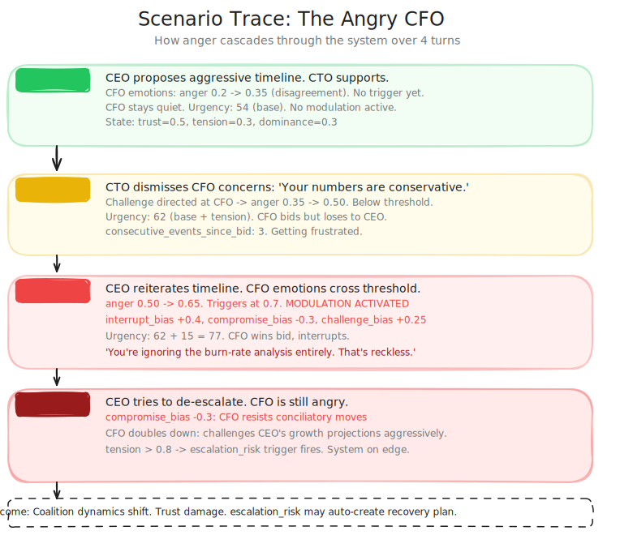

<div align="center">

# Boardroom Simulator

[](LICENSE)
[]()
[]()
[]()

</div>

A **synthetic social operating system** — multi-agent negotiation simulator where AI stakeholders with conflicting incentives debate, form coalitions, escalate, compromise, feel emotions, and execute multi-turn strategies.

Not a chatbot. An **event-driven cognitive society simulator**.

## Architecture

### Core Design Principle

**Language Generation** is separated from **Behavioral State Evolution**.

The LLM generates dialogue, tactical reasoning, and persuasive language.
Deterministic systems maintain coherence, social continuity, emotional state, and strategic evolution.

### 6-Layer Architecture

```
Layer 6: Narrative Layer (LLM)
Layer 5: Strategic Layer (planning, subgoals)
Layer 4: Cognitive Layer (emotions, modulation, urgency)
Layer 3: Social Physics Layer (trust, leverage, tension, etc.)
Layer 2: Relationship Layer (NxN pairwise matrix)
Layer 1: Procedural Layer (events, scheduling, bidding)
```

### What Makes This Different

| Aspect            | Typical Agent System  | This System                                                                  |
| ----------------- | --------------------- | ---------------------------------------------------------------------------- |
| **State**         | LLM context window    | Deterministic state machines + event sourcing                                |
| **Autonomy**      | Sequential turns      | Async, reactive, event-driven (`wait_for_change()`)                          |
| **Relationships** | Implicit in prompts   | Explicit NxN matrix (trust, fear, admiration, rivalry, alliance, dependency) |
| **Emotions**      | Described in text     | Numeric state with **causal behavioral effects**                             |
| **Strategy**      | None (reactive)       | Multi-turn plans with subgoal decomposition                                  |
| **Urgency**       | Round-robin or random | **Hybrid** — deterministic formula + LLM-inferred strategic importance       |
| **Debugging**     | Print statements      | Replay, state diff, 6+ visualization panels                                  |

### Six-Layer Architecture

[](docs/01-six-layer-architecture.excalidraw.svg)

### System Interaction Matrix

[](docs/05-system-interaction-matrix.excalidraw.svg)

## Behavioral Dynamics

### Emotional Causality

Emotions **causally shape behavior** — not just dialogue tone:

| Emotion         | Behavioral Effect                                      |
| --------------- | ------------------------------------------------------ |
| **anger** ≥ 0.7 | interrupt_bias +0.4, compromise_bias -0.3, urgency +15 |
| **fear** ≥ 0.6  | challenge_bias -0.2, coalition_bias +0.2               |
| **joy** ≥ 0.7   | compromise_bias +0.2, urgency -10                      |
| **shame** ≥ 0.6 | withdraws (speaks less, interrupts less)               |

### Hybrid Urgency

Bidding is **60% deterministic formula** (personality + state + emotions) **+ 40% LLM strategy score** (inferred strategic importance from recent context). 2-second timeout with graceful fallback.

### Strategic Horizon

Agents maintain **multi-turn plans** with subgoals. Triggers (e.g., `trust_collapse`, `credibility_crisis`) auto-create plans ("rebuild trust", "defend position"). Plans are injected into the LLM's system prompt each turn.

### Event Response Flow

[](docs/02-event-response-flow.excalidraw.svg)

### Emotional Causality Chain

[](docs/03-emotional-causality-chain.excalidraw.svg)

### Scenario Walkthrough: Angry CFO (Example)

[](docs/04-scenario-angry-cfo.excalidraw.svg)

## Personas (AI Stakeholders)

Reusable stakeholder library — 23 seeded personas across executive, finance, legal, technical, procurement, and comms roles. Each persona is a stable identity that persists across simulations.

| Field           | Example                                                      | Purpose                      |
| --------------- | ------------------------------------------------------------ | ---------------------------- |
| `name`          | "Priya Kapoor"                                               | Identity                     |
| `role`          | "Corp Dev VP"                                                | Functional hat               |
| `focus`         | risk posture, phased rollout readiness                       | Decision-making priorities   |
| `stance`        | champion / detractor / neutral / moderator / wildcard        | Starting position            |
| `personality`   | aggressiveness=40, empathy=70, stubbornness=30, verbosity=60 | 4-axis trait profile (0-100) |
| `hidden_agenda` | Needs a marquee AI partnership before fiscal year-end        | Private motivation           |
| `tag`           | SKEPTICAL / AGREEABLE / LOCKED / CALIBRATING / VISIONARY     | Behavioral label             |
| `tool_profile`  | financial / legal / technical / comms / none                 | Which tools the agent wields |
| `backstory`     | Free-text narrative                                          | Roleplaying context          |

### 6 Behavioral Archetypes

Archetypes bias emotion baselines and action tendencies — they define how a persona _feels by default_:

| Archetype       | Personality Bias                          | Emotion Bias          | Tendencies                    |
| --------------- | ----------------------------------------- | --------------------- | ----------------------------- |
| **Opportunist** | aggressive +10, empathy -10, stubborn -10 | joy +0.3, fear -0.1   | compromise 0.4, question 0.3  |
| **Idealist**    | aggressive -10, empathy +20, stubborn +30 | joy +0.2, anger +0.1  | statement 0.4, challenge 0.3  |
| **Diplomat**    | aggressive -20, empathy +30, stubborn -10 | joy +0.3, anger -0.1  | compromise 0.4, coalition 0.2 |
| **Pragmatist**  | neutral (no bias)                         | neutral               | balanced across all actions   |
| **Agitator**    | aggressive +30, empathy -20, stubborn +20 | anger +0.3, joy -0.1  | challenge 0.5, interrupt 0.3  |
| **Guardian**    | aggressive +10, empathy +10, stubborn +20 | fear +0.2, anger +0.1 | challenge 0.3, interrupt 0.2  |

### Persona Lifecycle

- **Library** (`/personas`) — browse, search, filter by stance or archetype
- **Editor** — create/edit name, role, backstory, personality sliders, stance, hidden agenda
- **Documents** — upload per-persona docs → Chroma embeddings → RAG-injected during simulation
- **Evolution** — simulations propose personality deltas; pending evolutions are reviewable
- **Cross-session memory** — key takeaways persist across simulations via Chroma

### Archetype Registry

Extensible `ArchetypeRegistry` at `backend/app/runtime/archetypes.py`. Custom archetypes can be registered at startup — no codegen required.

### From Persona to Agent

Each persona spawns an `AgentRuntime` with:

- **Private memory** — last 12 turn events with full context
- **Self-directed bidding** — urgency = personality base + emotion modulation + LLM strategy score (60/40 hybrid)
- **Emotional state machine** — anger/fear/joy/shame causally bias interrupt, challenge, compromise, coalition behavior
- **Strategic plans** — multi-turn subgoal decomposition; triggers auto-create plans (e.g., `trust_collapse` → "rebuild trust")
- **Knowledge injection** — Chroma RAG queries on each turn, drawing from uploaded docs + research + cross-session memory

## Demo

<video src="https://github.com/argahv/boardroom-simulator/raw/master/docs/assets/flow.mp4" controls width="100%"></video>

## Prerequisites

- Python 3.11+
- Node.js 20+
- OpenRouter API key (`OPENROUTER_API_KEY`)

## Quick Start

```bash
make install
make dev
```

Open `http://localhost:3000` in your browser. API docs at `http://127.0.0.1:8000/docs`.

### Manual Setup

```bash
# Backend
cd backend && python -m venv .venv && source .venv/bin/activate
pip install -r requirements.txt
cp .env.example .env   # add OPENROUTER_API_KEY
uvicorn app.main:app --reload --port 8000

# Frontend
cd frontend && npm install
echo 'NEXT_PUBLIC_API_URL=http://127.0.0.1:8000' >> .env.local
npm run dev
```

See [SETUP.md](SETUP.md) for the full setup guide, configuration options, and troubleshooting.

## Key Endpoints

| Method | Path                           | Description                        |
| ------ | ------------------------------ | ---------------------------------- |
| POST   | `/simulations`                 | Create simulation                  |
| GET    | `/simulations/{id}/stream`     | SSE stream (live)                  |
| GET    | `/simulations/{id}/replay`     | Ordered state snapshots for replay |
| GET    | `/simulations/{id}/export`     | Full simulation JSON download      |
| POST   | `/simulations/{id}/inject`     | Human turn injection               |
| POST   | `/simulations/{id}/postmortem` | LLM-generated analysis             |
| GET    | `/agents/{name}/detail`        | Agent profile + goals + strategy   |

Full API reference at `http://127.0.0.1:8000/docs`.

## Docs

| Doc                                                                | What's Inside                                                                                       |
| ------------------------------------------------------------------ | --------------------------------------------------------------------------------------------------- |
| [`docs/architecture-deep-dive.md`](docs/architecture-deep-dive.md) | Full component map, data flows, emergent properties, Layer 1-6 breakdown                            |
| [`docs/behavioral-dynamics.md`](docs/behavioral-dynamics.md)       | Emotional modulation rules, hybrid urgency mechanics, strategic planning scenarios, scenario traces |
| [`docs/ARCHITECTURE.md`](docs/ARCHITECTURE.md)                     | Behavior Engine architecture (v2 runtime)                                                           |
| [`docs/ROADMAP.md`](docs/ROADMAP.md)                               | Phased roadmap with success gates                                                                   |
| [`docs/tech-stack.md`](docs/tech-stack.md)                         | Technology decisions and rationale                                                                  |
| [`docs/snapshot-schema.md`](docs/snapshot-schema.md)               | State snapshot field reference                                                                      |

## Verification

```bash
# Using Make (recommended)
make test

# Or manually
cd backend && python -m pytest tests/
cd frontend && npx tsc --noEmit
```
