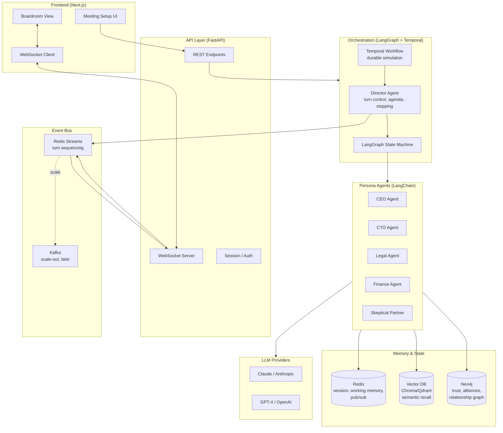

> ⚠️ **DEPRECATION NOTICE**: This document references v1 architecture (LangGraph StateGraph, Chroma memory). The current runtime is v2 Behavior Engine. See [`docs/ARCHITECTURE.md`](ARCHITECTURE.md) for the current architecture.

# Tech Stack — AI Boardroom Simulator

This document describes the technology stack for the AI Boardroom Simulator: a multi-agent negotiation system where autonomous persona agents (CEO, CTO, Legal, Finance, Skeptical Partner, etc.) deliberate, interrupt, form coalitions, and converge on decisions inside a simulated boardroom.

Each section explains **what role the technology plays in this specific system**, **why it was chosen over alternatives**, and **whether it belongs in the MVP or a later stage**.

---

## Table of Contents

1. [System Architecture](#system-architecture)
2. [Core & Orchestration](#core--orchestration)
3. [Agent Frameworks](#agent-frameworks)
4. [Memory & State](#memory--state)
5. [Event-Driven & Async Infrastructure](#event-driven--async-infrastructure)
6. [Frontend](#frontend)
7. [LLM Layer](#llm-layer)
8. [Which Tool Owns Which Problem](#which-tool-owns-which-problem)
9. [MVP vs. Later-Stage Stack](#mvp-vs-later-stage-stack)

---

## System Architecture

---

## Core & Orchestration

### Python

**Role:** Primary backend language. Hosts orchestration, agent definitions, memory adapters, and the FastAPI service.

**Why this system:** The agent ecosystem (LangChain, LangGraph, CrewAI, AutoGen, DSPy) is Python-first. Every meaningful abstraction we depend on has its canonical implementation in Python; equivalents in TypeScript or Go lag in features and community recipes. Cross-runtime gymnastics would slow MVP delivery.

**Notes:**
- Target Python 3.11+ for `asyncio.TaskGroup` and better exception groups (agent fan-out raises multiple errors).
- Use `uv` or `poetry` for deterministic locking — LangChain pins shift weekly.
- All agent invocations are `async`; never block the event loop inside an agent tool.

### FastAPI

**Role:** Public-facing API. Accepts meeting setup payloads (participants, goals, constraints, documents), kicks off simulations, streams agent turns to the client, and serves the final strategic briefing.

**Why over alternatives:**
- Native `async`/`await` — critical because a single boardroom session fans out to N concurrent LLM calls.
- First-class WebSocket support for live agent streaming (Flask/Django would require extra plumbing).
- Pydantic models map cleanly onto the structured outputs we demand from agents (e.g., `AgentTurn`, `Proposal`, `Vote`).

**Notes:**
- Run under `uvicorn` with `--workers` ≥ 2; orchestrator background tasks must use Temporal or a dedicated worker process, not in-process tasks that die with a reload.
- Use FastAPI's `BackgroundTasks` only for fire-and-forget telemetry, never for the simulation loop itself.
- Validate document uploads (company decks, market briefs) before they enter the vector store — bad chunks poison every agent's recall.

### LangGraph

**Role:** The brain of the boardroom. Models the simulation as an explicit state machine: which agent speaks next, when to escalate, when to call for a vote, when to terminate. Holds the canonical `BoardroomState` that every node mutates.

**Why over alternatives:** Sequential agent chains (plain LangChain) can't represent the dynamic we need — interruption, coalition formation, agenda backtracking. LangGraph's graph model lets us encode:
- A `Director` node that arbitrates turn order based on tension, expertise relevance, and recent speakers.
- Conditional edges (`if unresolved_conflict → escalate_to_vote`).
- Loops with explicit termination conditions (max rounds, consensus threshold, agenda exhausted).
- Checkpointing so a simulation can pause, persist, and resume — essential for long meetings and for "what if we rewound to turn 12 and changed the CEO's stance" branching scenarios.

**Notes:**
- Use the `SqliteSaver` or `PostgresSaver` checkpointer in MVP. The in-memory checkpointer loses state on restart.
- Keep `BoardroomState` small and serializable — it's checkpointed on every transition. Push large blobs (documents, full transcripts) to Redis/Vector and store IDs in state.
- The Director node is *also* an LLM agent, not hardcoded logic. It reads recent turns and decides who should speak next; hardcoding ruins emergent dynamics.

### LangChain

**Role:** The interop layer between agents and everything else. Provides LLM clients (Anthropic, OpenAI), prompt templates, tool-calling primitives, retrievers for the vector store, and document loaders for company materials.

**Why:** We don't use LangChain for orchestration (LangGraph owns that) — we use it as a normalization library. Swapping Claude for GPT-4 should be one line. Adding a new tool (e.g., `search_market_data`) should not require touching agent logic.

**Notes:**
- Prefer LangChain Expression Language (LCEL) for prompt + model + parser chains inside an agent's "think" step.
- Use `with_structured_output()` everywhere an agent produces machine-readable output (proposals, votes, sentiment scores). Free-form text is for the final transcript, not internal state.
- Pin `langchain-core` aggressively. Minor version bumps have broken tool-call schemas in the past.

---

## Agent Frameworks

The three frameworks below overlap in capability but have meaningfully different sweet spots. We do **not** use all three in production — the table below clarifies what each contributes and when it earns its place.

### CrewAI

**Role:** Role-based team composition. CrewAI's vocabulary (`Agent`, `Task`, `Crew`, `Process`) maps cleanly onto our domain (`CEO`, `negotiate_term_sheet`, `boardroom`, `sequential|hierarchical`).

**Why it fits:** Excellent for defining static personas with clear role descriptions, backstories, and goals — exactly the persona schema we need. Its built-in `hierarchical` process gives us a manager-led structure that mirrors a real boardroom chair.

**Why it isn't enough alone:** CrewAI's execution model assumes tasks complete in a planned order. Real boardrooms aren't planned — they explode. We rely on LangGraph for the interruption, coalition, and backtracking dynamics; CrewAI is most useful as a **persona definition format** and as a baseline executor for simpler scenarios.

**MVP vs. later:** Optional in MVP. If we're moving fast, define personas in plain Pydantic + LangChain and skip CrewAI's overhead until role-team semantics start saving us code.

### AutoGen

**Role:** Reference implementation for conversational multi-agent dynamics — agents talking *to each other*, not just to a central orchestrator. AutoGen pioneered patterns like `GroupChat`, `GroupChatManager`, and nested conversations.

**Why we study it:** Its conversation patterns (round-robin, auto-selection by an LLM speaker selector, nested side-bars between two agents) are the closest off-the-shelf approximation of our boardroom. The `GroupChatManager` is conceptually our Director.

**Why we don't necessarily run it:** AutoGen's state is implicit in the message history, which makes branching scenarios, checkpointing, and "rewind to turn 12" harder than in LangGraph. We borrow patterns, not the runtime.

**MVP vs. later:** Useful as a research/prototyping tool. Run AutoGen-based simulations side-by-side to validate that our LangGraph implementation produces comparable emergent behavior. Not in the production path.

### DSPy

**Role:** Programmatic prompt optimization. Instead of hand-tuning each agent's prompt, DSPy treats prompts as parameters and optimizes them against a metric (e.g., "did the Skeptic surface a real risk?", "did the CFO's proposal stay within the budget constraint?").

**Why it matters here:** Agent personas drift. A CEO prompt that produced sharp strategic moves last week starts hedging this week after a model update. DSPy lets us define a *signature* (input/output schema) and a *metric*, then re-compile prompts when the underlying model changes — no manual reprompting carnival.

**MVP vs. later:** **Not MVP.** Hand-write prompts first. Once we have a labeled dataset of "good boardroom turns" (probably from human reviewers grading agent outputs), introduce DSPy to optimize the persona modules. Premature optimization here is genuinely premature.

**Notes:** DSPy compiles into LangChain-compatible callables, so it slots into the agent layer without disturbing LangGraph.

---

## Memory & State

A boardroom agent needs three distinct kinds of memory, and a single store can't serve all three well.

### Vector DB — Chroma (MVP) → Qdrant (scale) → Pinecone (managed)

**Role:** Semantic memory. Stores chunked company documents (10-Ks, product specs, market briefs), prior meeting transcripts, and each agent's accumulated experience. When the CFO is asked about Q3 margins, the retriever surfaces the relevant 10-K passages and last quarter's earnings discussion.

**Why a vector store at all:** Persona agents need *grounded* answers. Without retrieval, a "CFO" hallucinates plausible-but-wrong financials, which destroys the simulation's utility.

**Choosing among them:**
- **Chroma** — MVP. Embedded, zero ops, in-process. Sufficient for single-tenant local development.
- **Qdrant** — When we need filtered search (per-company, per-agent, per-meeting), hybrid search, and decent multi-tenant performance without managed-service costs. Self-hostable.
- **Pinecone** — If we go SaaS and want zero-ops scale. More expensive; lock-in.

**Notes:**
- Each agent's retriever should be **scoped**: the CTO retrieves from engineering docs and prior technical discussions, not from the Legal corpus. Filter by `agent_role` and `company_id` metadata.
- Re-embed when you change models. Do not mix embeddings from different model families in one collection.
- Chunk size matters: 400–800 tokens with 50-token overlap is a sane default for corporate documents.

### Graph DB — Neo4j

**Role:** Relationship memory. Holds the social graph of the boardroom: who trusts whom, who has historically allied with whom, who escalated against whom in turn 7. Edges carry weights (`trust=0.4`, `aligned_on=["pricing"]`, `clashed_on=["risk_appetite"]`).

**Why a graph DB and not relational:**
- The questions we ask are graph-shaped: "Who is most likely to support the CEO if the CFO objects?" → 2-hop traversal weighted by trust and recent agreement.
- Coalition detection is a community-detection problem (Louvain, label propagation) — natively expressed in Cypher.
- Relationships evolve turn-by-turn; we need cheap edge updates, not schema migrations.

**Why not just keep this in Python dicts:**
- Branching scenarios mean we fork the relationship state, run an alternate timeline, and compare. A persistent graph makes forking and diffing tractable.
- Visualizing the negotiation heatmap (later-stage feature) is trivial off a graph DB.

**MVP vs. later:** Borderline MVP. If we ship the async briefing without the live boardroom view, we can defer Neo4j and approximate relationships with a Redis hash. Introduce Neo4j when coalition dynamics become a first-class output.

**Notes:**
- Model agents as nodes, *turns* as nodes too (not just edges) — a turn is a first-class entity that we'll query later for "show me all turns where Legal opposed Finance".
- Use APOC procedures for community detection; don't reinvent.

### Redis

**Role:** Three jobs, one process:
1. **Session state** — active simulation metadata, current turn index, agenda position. Keyed by `simulation_id`.
2. **Short-term working memory** — the last N turns' full text, fed back into agent prompts as conversational context. Lives in Redis lists with `LTRIM` for bounded growth.
3. **Pub/sub** — agent event fan-out. When the Director emits `agent_turn_complete`, the WebSocket layer subscribes and pushes to the browser.

**Why Redis owns all three:** Sub-millisecond latency on hot-path reads (every agent turn reads working memory), built-in pub/sub, and Redis Streams (below) give us a single dependency for the "fast and ephemeral" tier.

**Notes:**
- Set TTLs on session keys (`EXPIRE simulation:{id} 86400`). Abandoned sessions otherwise accumulate forever.
- Don't store the canonical transcript in Redis — that lives in Postgres / object storage. Redis holds the *working set*.
- Pub/sub messages are fire-and-forget. For ordered delivery, use Streams.

---

## Event-Driven & Async Infrastructure

### Redis Streams

**Role:** The agent event bus. Every turn, vote, proposal, interruption, and state transition is appended to a stream (`stream:simulation:{id}:events`). Consumers include:
- The WebSocket gateway (streams events to the browser).
- The transcript writer (persists to Postgres).
- The relationship-graph updater (mutates Neo4j edges based on event semantics).

**Why Streams over plain pub/sub:**
- **Ordered**, **replayable**, and **persistent within retention window**. Pub/sub drops messages if no one is listening; Streams don't.
- Consumer groups give us at-least-once delivery to each subsystem independently.
- The browser can reconnect and replay from a last-seen event ID — critical for the live room view.

**MVP relevance:** Yes. Even the async briefing benefits from an event log (debugging, audit, replay).

### Temporal

**Role:** Durable workflow orchestration for the simulation as a whole. A boardroom simulation can run for minutes (MVP async briefing) to hours (long-running, multi-session scenarios). Temporal guarantees that if a worker crashes mid-simulation, the workflow resumes from the last completed activity — no lost state, no half-deliberated decisions.

**Why Temporal and not just LangGraph checkpoints:**
- LangGraph checkpoints persist *state*. Temporal persists *execution history*: every LLM call, every tool invocation, every retry. Replaying a workflow gives us deterministic post-mortems.
- Temporal handles retries, timeouts, and exponential backoff for flaky LLM APIs as first-class primitives. We don't reimplement them in the agent loop.
- Long-running simulations (multi-day strategic planning sessions, later stage) need durable timers — Temporal's `workflow.sleep` survives restarts; `asyncio.sleep` doesn't.

**Why not Celery or Airflow:**
- Celery has no notion of durable, code-defined workflows. We'd reinvent state machines on top of tasks.
- Airflow is DAG-shaped and batch-oriented. Our workflows are dynamic and react to LLM output.

**MVP vs. later:** **Not strict MVP.** For the first async-briefing MVP, a single FastAPI background worker with LangGraph checkpoints is sufficient. Introduce Temporal when:
- Simulations exceed ~5 minutes wall-clock.
- We add branching scenarios that need durable rewind.
- We multi-tenant and need isolation + retries per simulation.

**Notes:**
- LangGraph nodes become Temporal activities. The Temporal workflow drives the LangGraph executor across activity boundaries so each LLM call is independently retryable.
- Keep activities idempotent — LLM calls are not naturally idempotent, so cache by `(prompt_hash, model, params)` in Redis.

### Kafka

**Role:** High-throughput event streaming **at scale**. When we move from "single simulation per Redis instance" to "thousands of concurrent simulations across a tenant fleet", Kafka replaces Redis Streams as the system-wide event backbone. Partition by `simulation_id` for ordered per-simulation delivery; consumer groups feed analytics, billing, and the live UI gateway.

**Why Kafka and not just bigger Redis:**
- Retention is measured in days/weeks, not minutes. Useful for analytics replay across simulations.
- Multi-consumer fan-out (analytics, billing, audit, UI, ML training pipeline) is what Kafka was built for.
- Mature ecosystem: Kafka Connect → S3 / Snowflake for the data warehouse later.

**MVP vs. later:** **Explicitly later-stage.** Do not introduce Kafka before there's a measured throughput problem. Premature Kafka adoption has killed more projects than it has saved.

---

## Frontend

### React / Next.js

**Role:** The user-facing app. Two primary surfaces:
1. **Meeting setup** — participants, goals, constraints, document uploads.
2. **Boardroom view** — live agent turns, agenda progress, decision log, and (later) the visual meeting room with the relationship/negotiation heatmap.

**Why Next.js:**
- App Router + Server Components let us render the strategic briefing as a server-rendered, SEO/share-friendly document — important because briefings are the MVP output and will be shared as URLs.
- Streaming SSR pairs well with WebSocket-driven turn-by-turn rendering: the page can hydrate with completed turns and stream incoming ones.
- API routes are useful for thin BFF (backend-for-frontend) work — proxying auth, formatting payloads — without inflating the FastAPI surface.

**Notes:**
- The Next.js app is a *client* of FastAPI, not a replacement. Do not move agent logic into Node.
- Use a state library that handles streams well (Zustand or Jotai). Redux is overkill for this surface area.

### WebSockets

**Role:** Live turn streaming from FastAPI to the browser. As each agent finishes a turn, the WebSocket pushes the structured event (`{agent_id, turn_id, content, sentiment, addressed_to}`) to the client, which renders it in the boardroom view.

**Why WebSockets over SSE:**
- Bidirectional: the user can interrupt the simulation, ask an agent a question mid-meeting, or vote on a proposal. SSE is one-way.
- Persistent connection survives token-by-token streaming of long agent monologues.

**Notes:**
- Authenticate the WebSocket on `connect` using a short-lived token from the REST API; do not rely on cookies alone.
- Backpressure: if the client is slow, the server should buffer to Redis Streams (the client replays from last seen event ID on reconnect) rather than block the agent loop.
- Implement heartbeat ping/pong every 20–30s; agent silences during deliberation should not look like disconnections.

---

## LLM Layer

### Claude (Anthropic) — primary; GPT-4 (OpenAI) — fallback/comparison

**Role:** The cognitive engine of every persona. Each agent turn is, at root, one or more LLM calls with a persona-shaped system prompt and a retrieved-context-stuffed user prompt.

**Why Claude as primary:**
- Strong instruction-following on long, structured system prompts — essential because each persona's prompt encodes role, company context, goals, personality, and behavioral constraints.
- Larger context window helps when an agent must reason over the entire transcript + retrieved documents + agenda.
- Tool-use semantics are reliable for the structured-output cases (proposals, votes).

**Why also keep GPT-4 reachable:**
- A/B comparison across models surfaces persona-prompt brittleness.
- Different agents may be backed by different models — e.g., a Skeptic agent on GPT-4 produces meaningfully different objections than the same prompt on Claude, which is itself a useful simulation feature.

**Notes:**
- Abstract behind a single `LLMClient` interface; never call the SDK directly from agent code. This is the single most important decoupling in the system — model providers change quarterly.
- Cache by `(prompt_hash, model, params)` in Redis. Persona agents repeat themselves more than you'd think during testing.
- Token budgets per turn must be enforced. A single rambling agent can blow a simulation's cost ceiling. Hard cap per turn and per simulation.
- Temperature: Director ~0.2 (deterministic turn arbitration), persona agents ~0.7 (in-character variability), structured-output calls 0.0.

---

## Which Tool Owns Which Problem

| Problem | Owner | Why |
|---|---|---|
| Primary language | Python | Ecosystem alignment with agent stack |
| HTTP / WebSocket API | FastAPI | Async-native, Pydantic, WS support |
| Turn order, agenda, stopping conditions | LangGraph | Explicit state machine for emergent dynamics |
| LLM clients, prompts, tools, retrievers | LangChain | Provider-agnostic interop layer |
| Persona definition format | CrewAI (optional) or Pydantic | Role-shaped vocabulary |
| Multi-agent conversation patterns | AutoGen (reference) | Pioneered GroupChat dynamics |
| Prompt tuning under model drift | DSPy (later) | Programmatic optimization |
| Semantic recall over docs & history | Vector DB (Chroma → Qdrant) | Grounded persona answers |
| Trust, alliances, coalitions | Neo4j | Graph-shaped queries |
| Session state, working memory | Redis | Sub-ms reads on hot path |
| Turn-by-turn event bus | Redis Streams | Ordered, replayable, lightweight |
| Durable long-running simulations | Temporal (later) | Survives crashes, retries, durable timers |
| Cross-tenant event backbone at scale | Kafka (later) | Multi-consumer fan-out, retention |
| User UI | Next.js | SSR briefings + streamed turns |
| Live turn delivery to browser | WebSockets | Bidirectional, persistent |
| Underlying reasoning | Claude (+ GPT-4) | Long context, instruction-following |

---

## MVP vs. Later-Stage Stack

The full stack above is the destination, not the starting point. Ship in this order:

**MVP (async strategic briefing):**

- Python + FastAPI
- LangGraph + LangChain
- Claude (single provider)
- Chroma (embedded vector store)
- Redis (session, working memory, Streams)
- Next.js for setup form + rendered briefing
- LangGraph SQLite checkpointer

This is sufficient to spawn personas, run a constrained simulation, emit a structured briefing, and render it.

**v1 (live boardroom view):**

- Add WebSockets for streaming turns.
- Add Neo4j for relationships / coalitions.
- Upgrade Chroma → Qdrant if filtered/multi-tenant search becomes a bottleneck.

**v2 (scale and durability):**

- Introduce Temporal for durable workflow orchestration.
- Add branching scenarios (fork checkpoints, compare timelines).
- Introduce DSPy for prompt optimization once we have a graded dataset.

**v3 (multi-tenant scale):**

- Migrate the event bus from Redis Streams to Kafka.
- Move vector store to managed (Pinecone) or hardened self-hosted Qdrant cluster.
- Add per-tenant isolation in Temporal namespaces.

Resist introducing anything from a later stage before its problem actually appears. The agent stack itself changes fast enough; infrastructure churn on top of that is what kills timelines.
